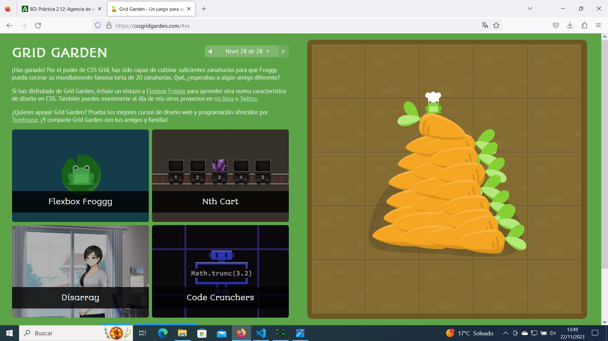

# GRID GARDEN

## Listado:
- **grid-column-start:**
Selecciona el borde vertical contando desde la izquierda de la cuadrícula.
- **grid-column-end:**
Indica en que columna terminará el ítem de la cuadrícula.
- **grid-column:**
Es una propiedad abreviada que acepta ambos valores a la vez, separados por una barra
oblicua. Ejemplo: grid-column: 2 / 4;
- **grid-row-start:**
Indica en que fila empezará el ítem de la cuadrícula.
- **grid-row-end:**
Indica en que fila terminará el ítem de la cuadrícula.
- **grid-row:**
Define la posición de un elemento respecto a las filas de la cuadrícula.
- **grid-area:**
Define la posición y tamaño de un elemento en la cuadrícula.
- **order:**
Define el orden del elemento de la cuadrícula.
- **grid-template:**
Define el tamaño y nombres de las filas y columnas de la cuadrícula.
- **grid-template-columns:**
Especifica el tamaño y los nombres de las columnas de la cuadrícula.
- **grid-template-rows:**
Define tamaño y los nombres de las filas de la cuadrícula.
- **: span;**
se indica cuántas celdas debe comprender el objeto en una determinada dirección.
- **: repeat;**
Repite los pasos hasta que la condición se cumpla.
- **: fr;**
Fracciona una parte de una fila entera.
- **: px;**
Fija el tamaño de una cuadríc