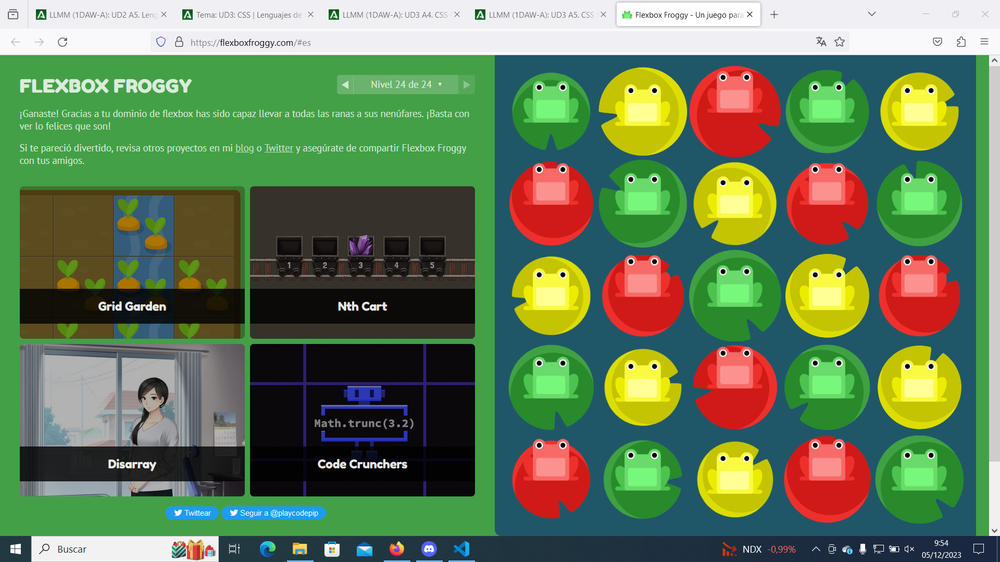

# CSS flexbox. Flexbox Froggy

## Listado
- **justify-content** Alinea los elementos flex a lo largo del eje principal.
- **flex-start** Alinea elementos al lado izquierdo del contenedor.
- **flex-end** Alinea elementos al lado derecho del contenedor.
- **center** Alinea elementos en el centro del contenedor.
- **space-between** Muestra elementos con la misma distancia entre ellos.
- **space-around** Muestra elementos con la misma separación alrededor de ellos.
- **align-center** Alinea elementos Flex a lo largo del eje transversal.
- **baseline** Muestra elementos en la línea base del contenedor
- **stretch** Elementos se estiran para ajustarse al contenedor.
- **flex-direction** Define la dirección del eje principal.
- **row** Elementos son colocados en la misma dirección del texto.
- **row-reverse** Elementos son colocados en la dirección opuesta al texto.
- **column** Elementos se colocan de arriba hacia abajo.
- **column-reverse** Elementos se colocan de abajo hacia arriba.
- **order** Especifica el orden de los elementos flex.
- **align-self** Alinea un elemento flex a lo largo del eje transversal, anulando el valor de align-items.
- **align-content** Alinea las líneas de un contenedor flex cuando exista más espacio en el eje transversal.
- **align-items** Alinea elementos Flex a lo largo del eje transversal.
- **flex-wrap** Especifica si los elementos flex son forzados a una sola línea o puede ser envueltos en multiples líneas.
- **nowrap** Cada elemento se ajusta en una sola línea.
- **wrap** los elementos se envuelven alrededor de líneas adicionales.
- **wrap-reverse** Los elementos se envuelven alrededor de líneas adicionales en reversa.
- **flex-flow** Abreviación de las propiedades de flex-direction y flex-wrap.