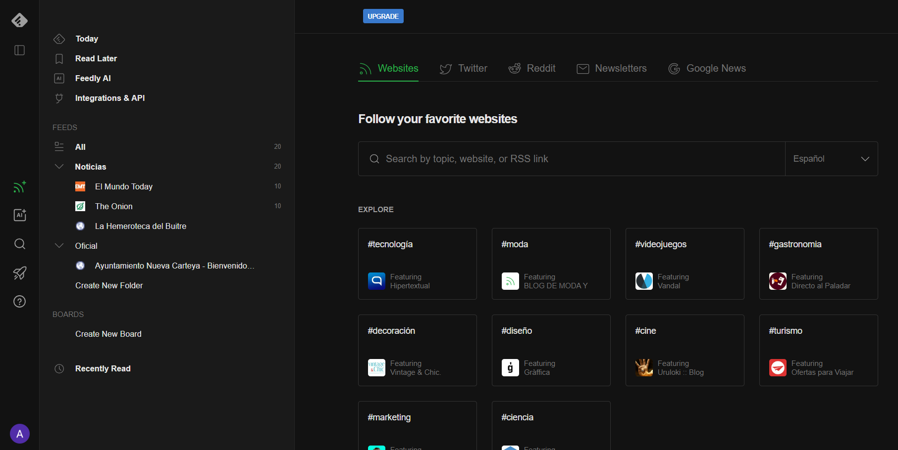
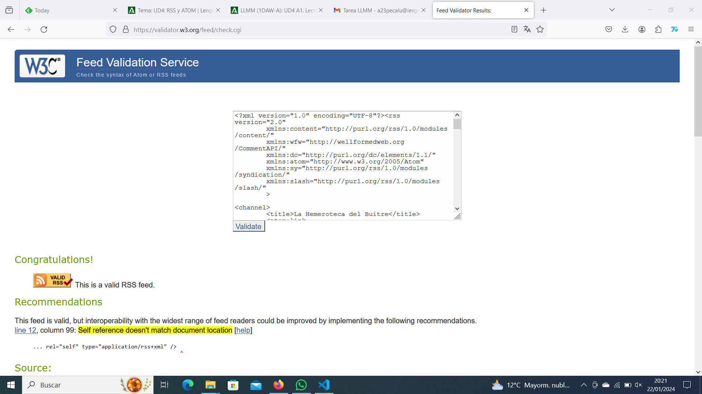
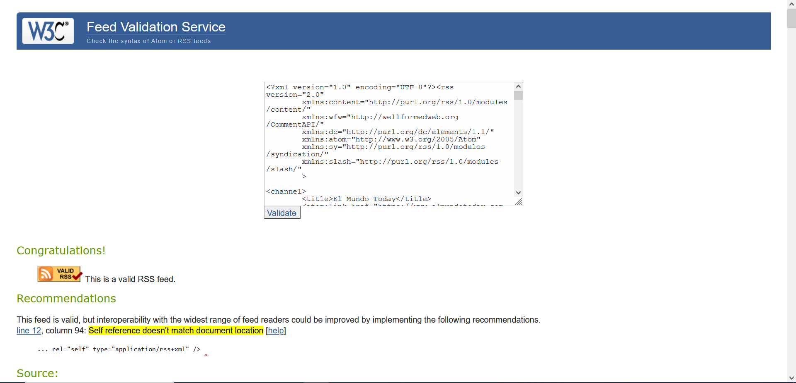

### Date de alta en feedly.com y:

* Añade varias fuentes relacionadas con un tema personal y original

* Añade a la categoría de noticias

  * Añade al menos 3 fuentes relacionadas con las noticias. 

* Añade la fuente de una administración concreta

* De cualquiera de las fuentes encontradas extrae los ficheros XML con formato rss o atom y súbelos al repositorio.
    * Fichero rss
    * Fichero atom
* Toma cada uno de los ficheros RSS y comprueba su validez
    * Fichero rss válido
        * fuente
        * imagen validator
    * Fichero atom
        * fuente
        * imagen validator
* Haz un listado de las etiquetas* principales, debidamente organizadas
    * Fichero rss
    * Fichero atom

# Feedly:

# Archivos RSS de tres fuentes de noticias:

El Mundo Today [RSS](./ficheros/elmundotoday_RSS.xml)

The Onion News [RSS](./ficheros/theonion_RSS.xml)

La Hemeroteca del Buitre [RSS](./ficheros/hemerotecabuitre_RSS.xml)

# Archivo RSS de una fuente oficial:

Ayuntamiento de Carteya [RSS](./ficheros/aytocarteya_RSS.xml)
   

# Validación de dos archivos RSS:

## Hemeroteca del Buitre

## Ayuntamiento de Nueva Carteya

# Validación Fichero ATOM

# Etiquetas Principales

Las etiquetas principales de los archivos RSS:

* Fichero RSS
  * Etiqueta 'rss'
    * Etiqueta 'channel'
      * Etiqueta 'title'
      * Etiqueta 'link'
      * Etiqueta 'description'
      * Etiqueta 'lastBuildDate'
      * Etiqueta 'language'
      * Etiqueta 'webMaster'
      * Etiqueta 'item'
        * Etiqueta 'title'
        * Etiqueta 'link'
        * Etiqueta 'pubDate'
        * Etiqueta 'category'
        * Etiqueta 'guid'

* Etiqueta 'description'
* Etiqueta 'link'
* Etiqueta 'category'

Las etiquetas principales de los archivos ATOM:

* Fichero Atom
  * Etiqueta 'feed'
    * title
    * subtitle
    * link
    * id
    * rights
    * update
    * author
    * name
    * uri
    * email
      * entry
        * category
        * id
        * link
        * published
        * summary
        * title
